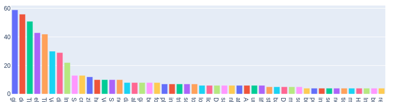

# Facebook Data Visulizer

The main goal of this tool is to provide a way to visualize some of the (occasionally creepy) data that collects

# Tools

Plotly & Jupyter

# Current Graphs

- Recording of your website activity when not on Facebook


  


- Time timeline in which they were recorded


  


- Bar Graph of who you message and how much

  


- Timeline of when you messaged people and message content

  

- Bar Graph of Who's posts you react to

  
# Setup

Clone the Repo

Download Your Facebook data and move it under the folder data/ 

In the first cell of facebook.ipynb set the name of FACEBOOK_FOLDER to the name of your facebook folder. You don't need to set the path, just the name of the folder.

In the Repo create a virtual enviroment and activate it

```
python3 -m venv venv
source venv/bin/activate
```

Install Dependancies
```
pip install -r requirements.txt
```

Run the Project with
```
jupyter notebook
```


MIT License

Copyright (c) 2020 Tyler Schmitz
